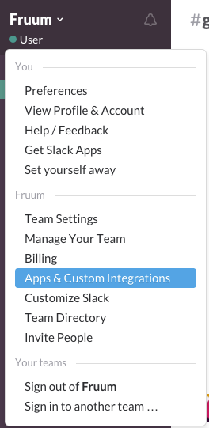
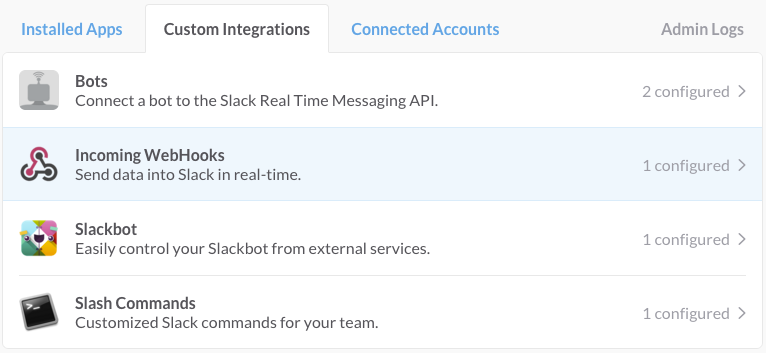
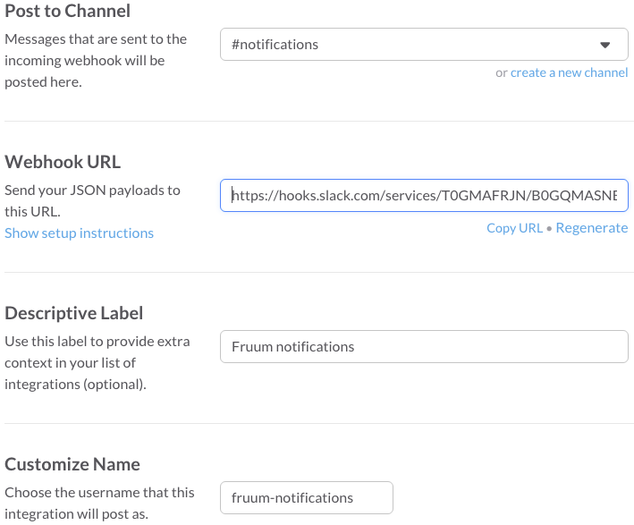
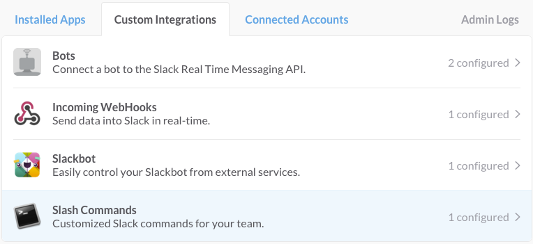
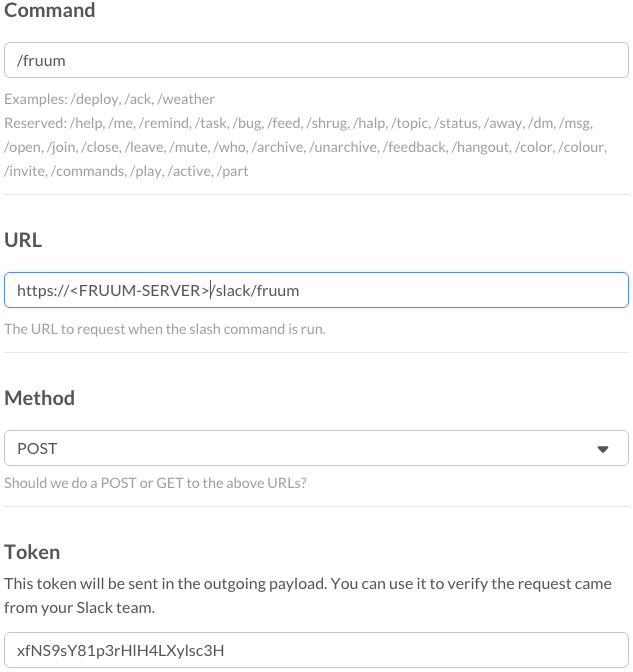

## Slack
Installation instructions

To enable the Slack plugin edit ```config.json``` and add the following entry (if not already there) in the ```plugins``` section:

```
...
"plugins": [
    ...
    "slack",
    ...
],
```

Configure notifications

You can setup slack to receive notifications when a new post is submitted on Fruum. To do this select **Apps & Custom Integrations** from you slack menu.



Then click **Configure**.


Then select **Incoming WebHooks** and **Add Configuration**.



Fill all the fields like the screenshot below and copy the **Webhook URL** field.



Attach the webhook URL to your Fruum forum by using the command:

```
npm start -- --set-app-property myforum --property "slack:incoming_webhook" --value "<WEBHOOK_URL>"
```

Configure command

On this guide you will learn how to add a ```/fruum``` command on slack to remotely communicate with Fruum.

On the **Apps & Custom Integrations** select the **Slack Commands** entry and press **Add Configuration**.



Fill in the form with the appropriate data as the example on the screenshot below by replacing the ```<FRUUM-SERVER>``` with the URL of your fruum server instance.



Optionally you can secure your slack command integration by setting the slack token to your Fruum forum by executing the command:

```
npm start -- --set-app-property myforum --property "slack:command_token" --value "<TOKEN>"
```

You can now use the fruum command to search for topics such as:

```/fruum <search>```
