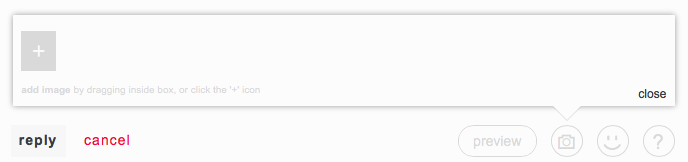

##Attaching images

You can attach images in your posts by using the camera icon on the footer. PNG and JPEG images are supported.

Pressing it will reveal a popup where you can:

 - Click the + icon to add one or multiple images from your hard drive
 - Drag and Drop an image file inside the popup
 - Paste an image from clipboard (Chrome only)



After that, a shortcut to your image will be added in the text input in the form of

```
[[image:<filename>]]
```

and you can move it to the appropriate place.

> TIP: You can use **preview** mode to see how your images look like.

Note that large images will be downscaled to a max of 800x800 pixels.
